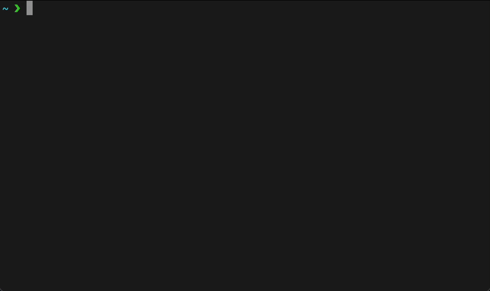

# xmas

ターミナル上にクリスマスツリーを表示します

## Install

```
$ deno install --name xmas https://raw.githubusercontent.com/YuG1224/kusa/main/app.ts
```

## Usage

```
$ xmas --height 10 --message 'Happy Xmas!'
```


